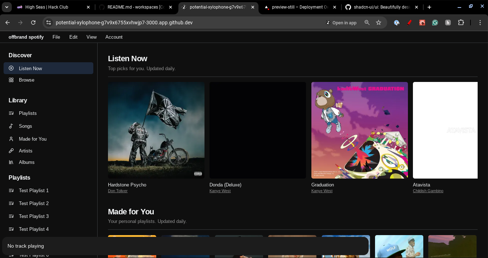

Next.js project based on [shadcn/ui](https://github.com/shadcn-ui/ui)'s music template
# Project Still (Water)
> i had no other ideas for my project

is this a redesign of my offbrand spotify project right now is it not that functional, and this is very new to me due to the fact this is typescript based.

### Preview

## Getting Started

Install the required packages

```bash
npm i
```

Then, run the development server:

```bash
npm run dev
```